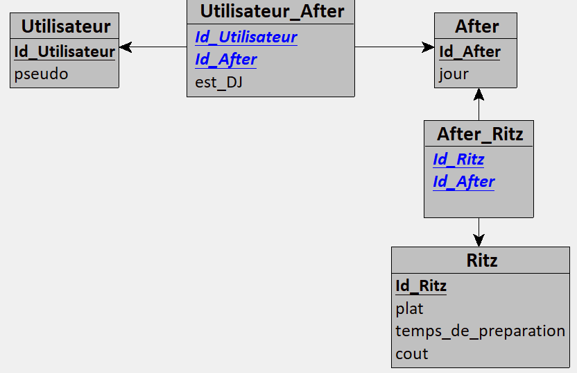
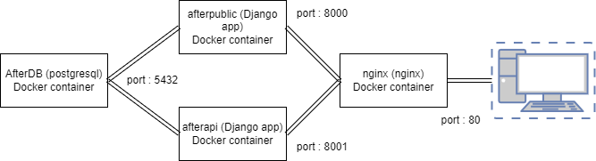

# CSC 8567 - Projet After2125

### Schema de la DataBase


### Schema des containers


### Listes des pages disponibles

- '/public/' Main page du site web
- '/public/Menus' Page des menus dispos
- '/api/index' Serialized field de la page /public/
- '/api/Menus' Serialized field de la page /public/Menus

## Questions

### afficher idex.html  

- 'DjangoProject/public/templates/index.html'
```html 
<!DOCTYPE html>
<html>
    <head>
        <title>Accueil - App Django</title>
    </head>
    <body>
        <h1>Bienvenue sur l'accueil de mon site</h1>
    </body>
</html>6
```

- 'DjangoProject/public/view.py'

```py
    from django.shortcuts import render

    def index(request):
        return render(request, 'public/index.html')
    
 - 'DjangoProject/public/urls.py' -> fichier urls de l'app
    ```py
    from django.urls import path
    import views

    urlpatterns = [
        path('', views.index, name='index'),
    ]
    ```
  - 'DjangoProject/DjangoProject/urls.py' -> fichier urls du projet complet
    ```py
    from django.contrib import admin
    from django.urls import path, include

    urlpatterns = [
        path('admin/', admin.site.urls),
        path('', include('public.urls')),
    ]
    ```
### Configuration de la BDD
Pour configurer la base de données, on utilise la variable `DATABASES = []` de 'projet/settings.py'

exemple 
```py
DATABASES = {
    'default': {
        'ENGINE': 'django.db.backends.postgresql',
        'NAME': os.getenv('POSTGRES_DB'),
	    'USER': os.getenv('POSTGRES_USER'),
	    'PASSWORD': os.getenv('POSTGRES_PASSWORD'),
	    'HOST': 'db',
	    'PORT': '5432',
    }
}
```

### Fichiers de paramètres
  - 'projet/settings.py' : ce fichier permet de configurer les paramètres d'exécution de django, il est possible d'utilise un fichier différent grâce à la variable d'environement `DJANGO_SETTINGS_MODULE`
  - 'projet/asgi.py' ou 'projet/asgi.py': ce(s) fichier(s) permetent de définir les paramètres appliqués au serveur web (ex: Gunicorn) lors d'un déploiement en prodution

  exemple appel de wsgi pour gunicorn
```py

    gunicorn After2125.wsgi:application \
    --bind 0.0.0.0:8000 \
    --workers 3  # You can adjust the number of workers based on your server

```
  
-### Migrations BDD
  - `python manage.py makemigrations` : cette commande génère les fichiers de migration (modification) de la base de données à partir des modèles définis dans 'models.py' et les stockes dans 'public/migrations/'. Cela ne concerne pas le peuplement de la base de données mais bien les modifications de la structure.
  - `python manage.py migrate` : cette commande applique les migrations à la base de données à partir des migrations dans 'public/migrations/'

  ### Docker

- Syntaxe Dockerfile
  - `FROM` : spécifie l'image sur laquelle on se base
  - `RUN` : exécute une commande pendant le build
  - `WORKDIR` : spécifie le répertoire de travail (cwd)
  - `EXPOSE` : spécifie un port à rendre accessible depuis l'hôte
  - `CMD`  : spécifie la commande de démmarage du conteneur
- Syntaxe docker-compose.yml
  - ```
    ports: -> liste des ports du conteneur à rendre disponible sur l'hôte
      - "80:80" -> host:ct = on affecte le port 80 de l'hôte au port 80 du conteneur
    ```
  - ```
    build: -> spécifie que l'on utilise va utiliser une image locale que l'on va build
      context: . -> spécifie le dossier utilisé pour build l'image
      dockerfile: Dockerfile.api -> spécifie le Dockerfile utilisé par l'image
    ```
  - ```
    depends_on: -> liste les conteneurs devant démarrer avant le conteneur actuel
      - web
      - api
    ```
  - ```
    environment: -> spécifie la liste des variables d'environement à passer au conteneur pour l'exécution
      POSTGRES_DB: ${POSTGRES_DB}
      POSTGRES_USER: ${POSTGRES_USER}
      POSTGRES_PASSWORD: ${POSTGRES_PASSWORD}
    ```
- Pour définir une variable d'environement dans un conteneur on peut utiliser :
  - la section `environement:` dans le *docker-compose.yml*
  - l'option `-e` avec *docker run*
  - l'instruction `ENVIRONEMENT` dans le *Dockerfile*
- On peut utiliser le nom du conteneur *web* dans la configuration du conteneur *nginx* grâce à la résolution interne des noms réalisée par docker pour les conteneurs d'un même réseau
